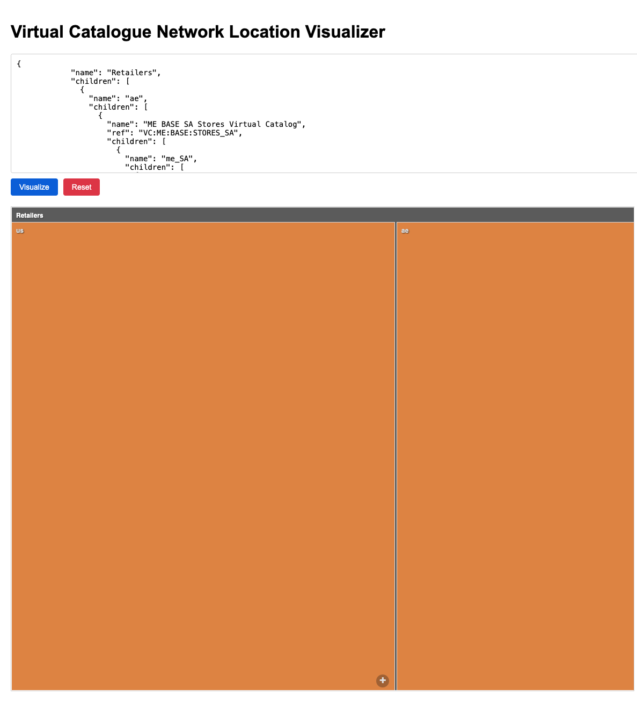
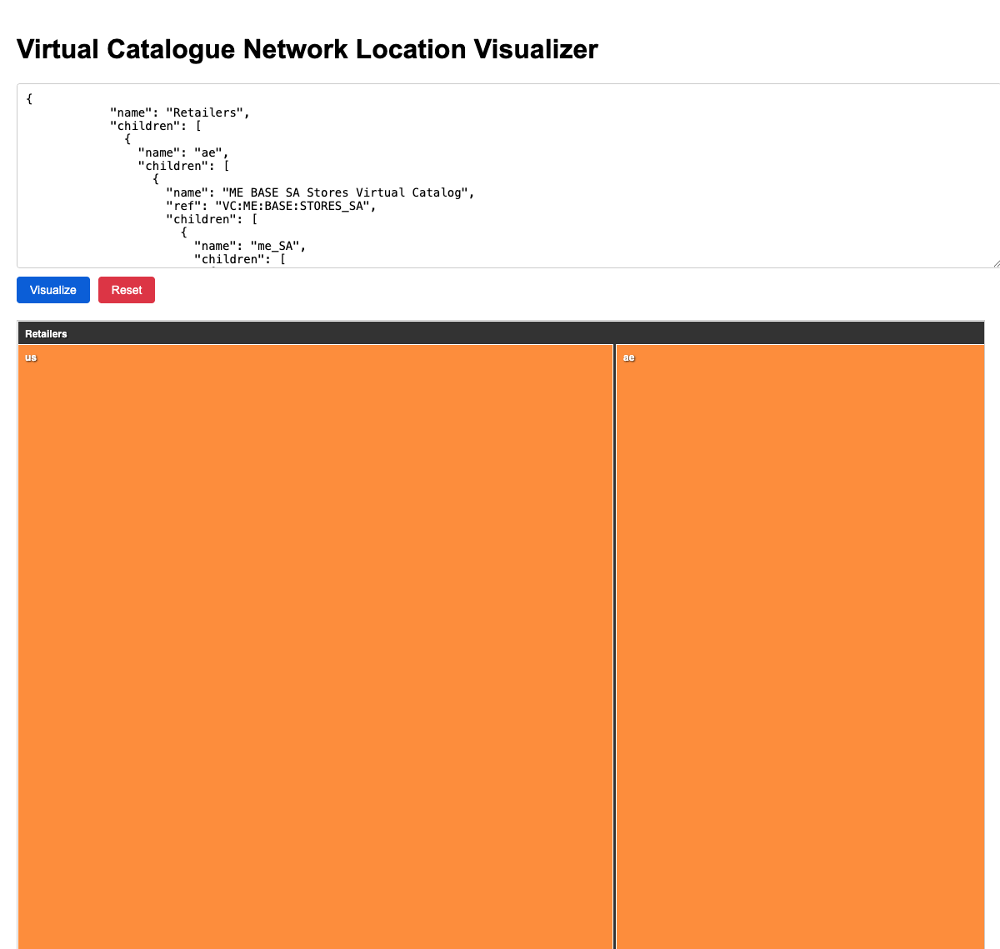
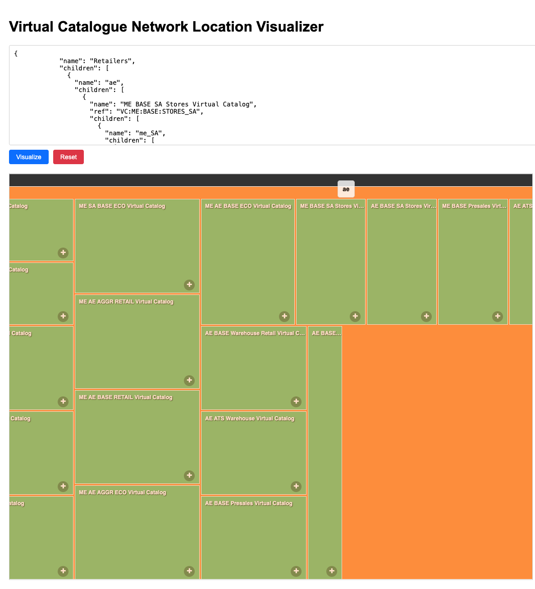
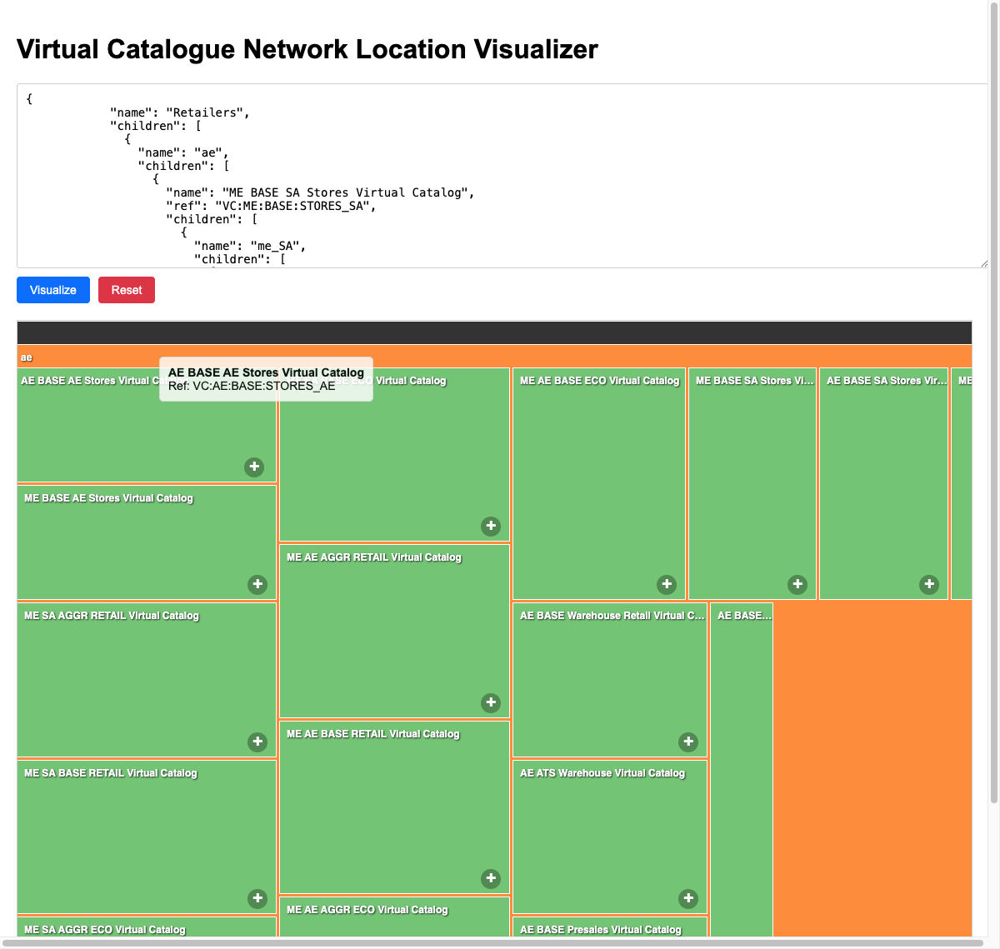

# Bridging the Translation Gap: Visualizing Your Inventory Network

Managing a global fulfillment network is a balancing act of precision and speed. At the heart of this complexity in Fluent Commerce is the Virtual Catalogue—the "brain" that determines how inventory flows from stores and warehouses to the customer.

But as networks scale, this brain often becomes a "black box."

### The Complexity Tax: When JSON Becomes a Barrier

In a typical large-scale implementation, Virtual Catalogue configurations can span thousands of lines of nested JSON. For an Operations Manager, this isn't just a technical detail—it's a massive "Translation Gap."

When every fulfillment rule is buried in code, answering simple operational questions becomes a manual marathon:
*   "Which stores are currently serving our 'Flash Sale' catalogue?"
*   "Is this new warehouse correctly mapped to our regional networks?"
*   "Why is an order being routed to a store 500 miles away instead of the one next door?"

The result? Hours wasted in meetings trying to "decode" configurations and a constant risk of "lost in translation" errors that impact the bottom line.

## Introducing the Fluent Inventory Visualizer: Turning Chaos into Clarity

We built the **Fluent Inventory Visualizer** to bridge this gap. It’s a "Single Pane of Glass" that transforms abstract configuration into an interactive, actionable map. 

By turning raw data into a visual hierarchy, we’ve moved from "decoding" to "deciding."

### Key Features: From Global Strategy to Local Detail

The Visualizer uses an interactive treemap (powered by D3.js) to provide a seamless "Macro-to-Micro" experience:

#### 1. Hierarchical Drill-Down

Navigate from a global view of all Retailers down to specific Virtual Catalogues, Networks, and individual Locations in seconds. No more digging through files; just click to explore.

#### 2. Instant Outlier Detection

The tool uses consistent color-coding and dynamic sizing to help you spot misconfigurations at a glance. If a store is in the wrong network, it stands out visually before it ever causes a fulfillment error.

#### 3. Live Data Validation
Paste your latest configuration JSON and see it come to life instantly. This allows for rapid prototyping and validation of new fulfillment rules before they are rolled out to production.

### The Impact: Faster, Smarter, Safer Operations

For an Operations Manager, the Visualizer isn't just a "nice-to-have" tool—it’s an operational multiplier:

*   **Troubleshoot in Minutes, Not Hours:** Trace routing issues visually instead of grepping through log files.
*   **Confident Rollouts:** Verify complex network changes visually before they go live.
*   **Shared Language:** Align developers, architects, and business owners around a single source of visual truth.

## Mastering Complexity through Visualization

In the world of modern commerce, complexity is inevitable—but being blinded by it is optional. The Fluent Inventory Visualizer ensures that your fulfillment "brain" is always visible, understandable, and optimized.

**Ready to bring clarity to your inventory network?**
[Contact us for a demo or consultation]

